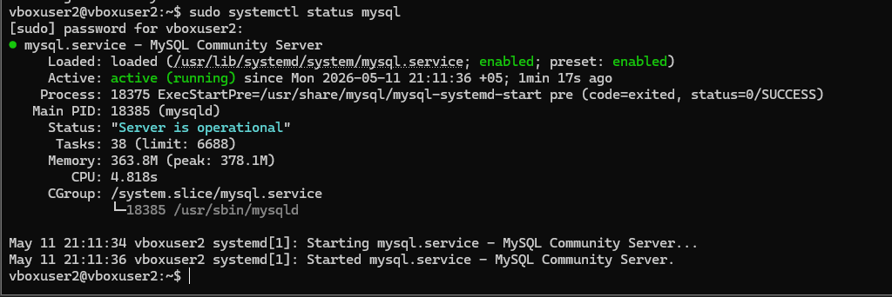
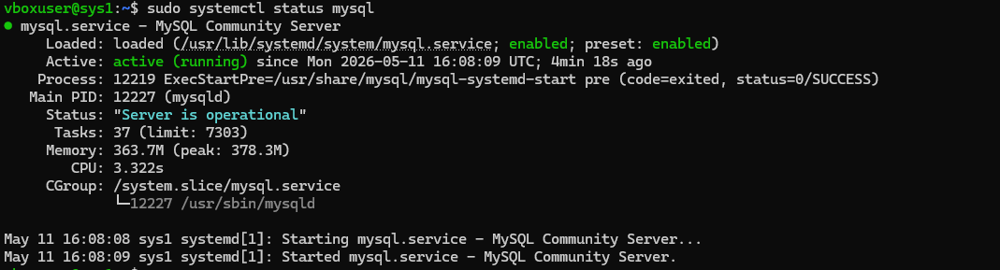
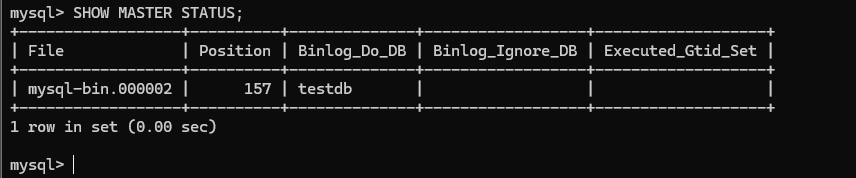

# replacation_part_1

**Кolesnikov Aleksandr**  

## Задание 1
Master-Slave репликация — это схема, где один сервер является основным, то есть master, а второй сервер получает с него копию данных как slave. Все изменения выполняются на master, после чего передаются на slave через бинарные логи. Slave обычно используют для резервного чтения, бэкапов, аналитики или отказоустойчивости. Запись на slave обычно не выполняют, чтобы не получить расхождение данных.

Master-Master репликация — это схема, где оба сервера одновременно являются и master, и slave друг для друга. Каждый сервер может принимать изменения и передавать их второму серверу. Такая схема удобна для отказоустойчивости и распределения нагрузки, но сложнее в настройке. Главная проблема master-master — возможные конфликты данных, например если на двух серверах одновременно изменить одну и ту же запись.

Главное различие: в master-slave запись идет на один основной сервер, а второй только копирует данные. В master-master оба сервера могут принимать изменения, но требуется аккуратная настройка, чтобы избежать конфликтов.

## Задание 2

### 1 Скриншот 
На скриншоте статус службы MySQL на сервере Master. Служба успешно запущена для работы репликации.

### 2 Скриншот
На скриншоте статус службы MySQL на сервере Slave. Служба находится в активном состоянии и готова к работе.

### 3 Скриншот
Показано состояние Master-сервера и параметры бинарного лога, используемые для настройки репликации.

